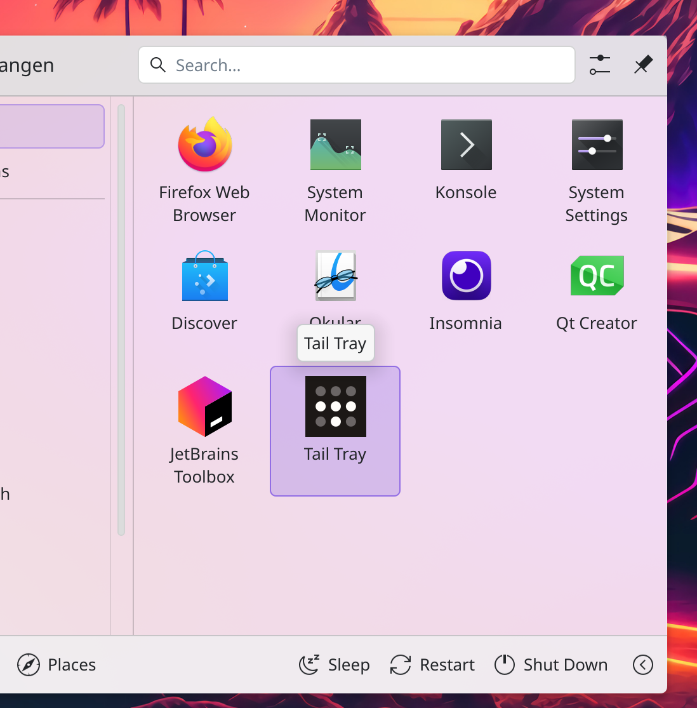
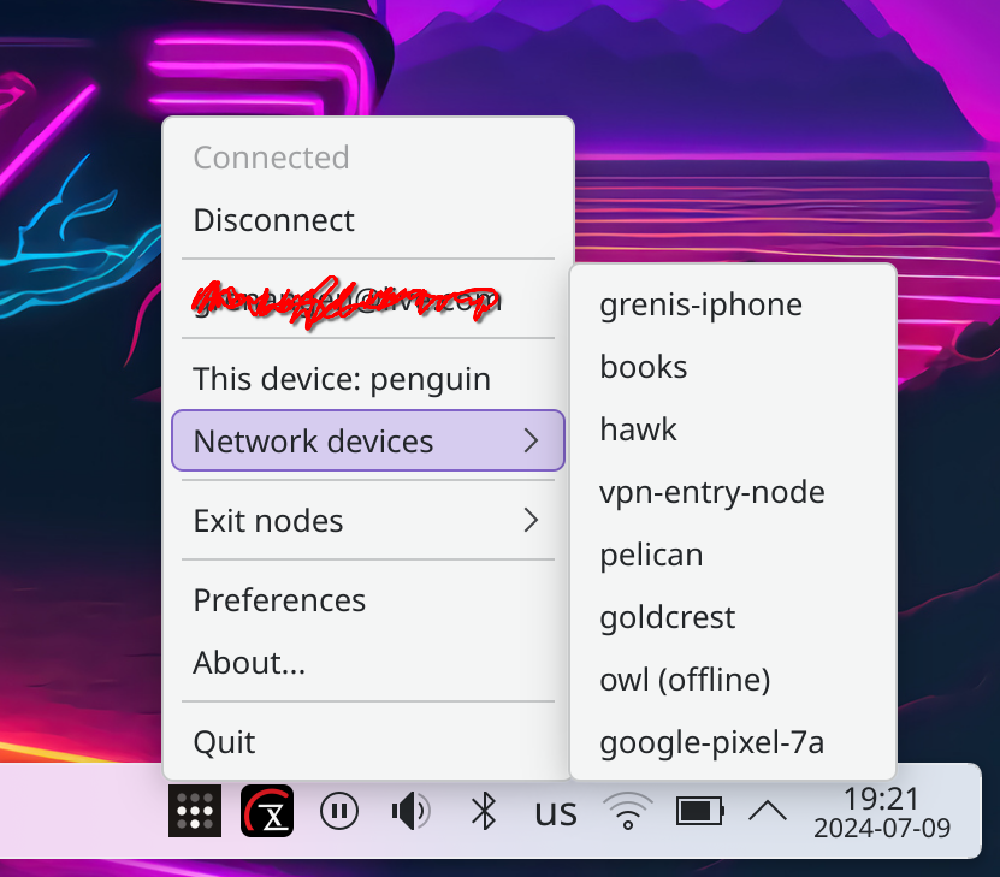
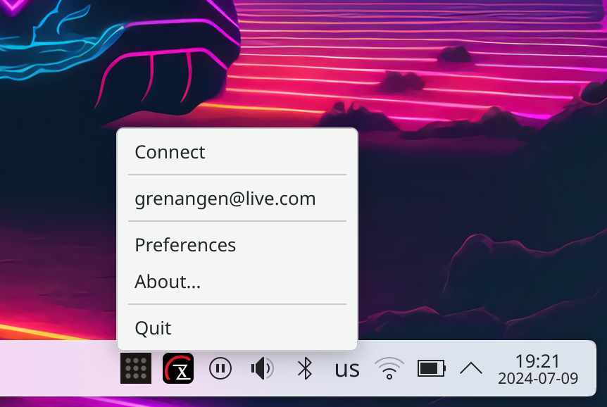
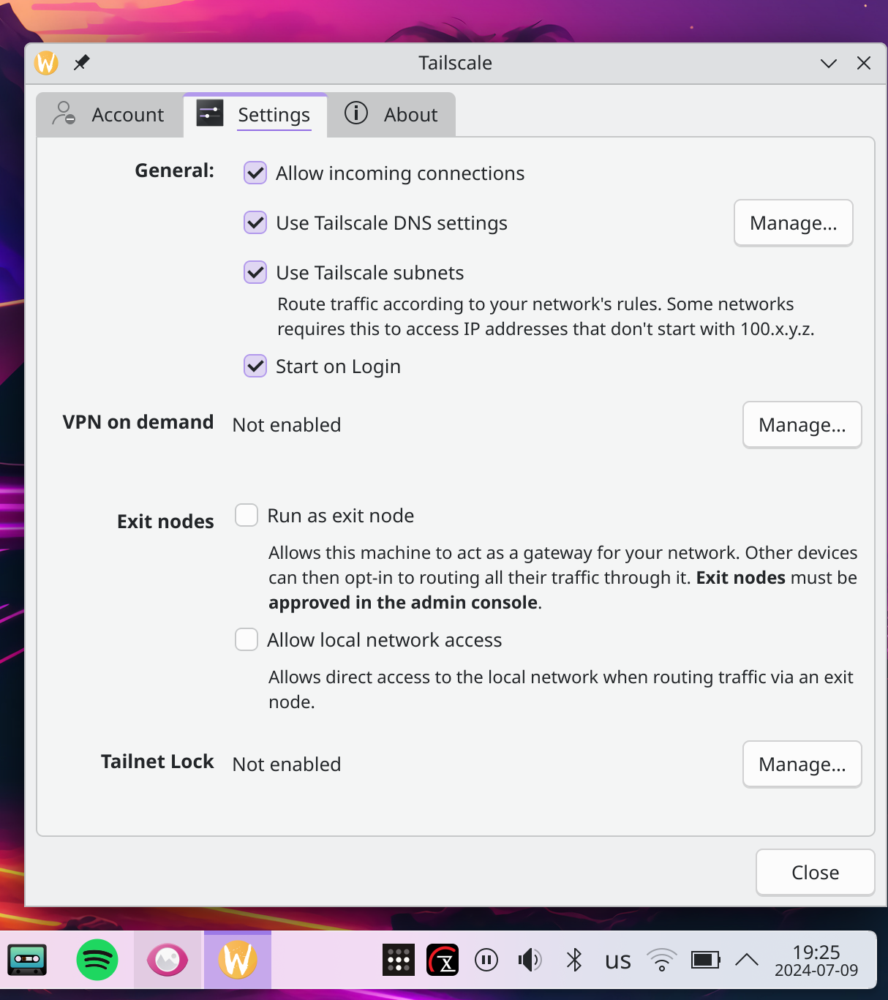
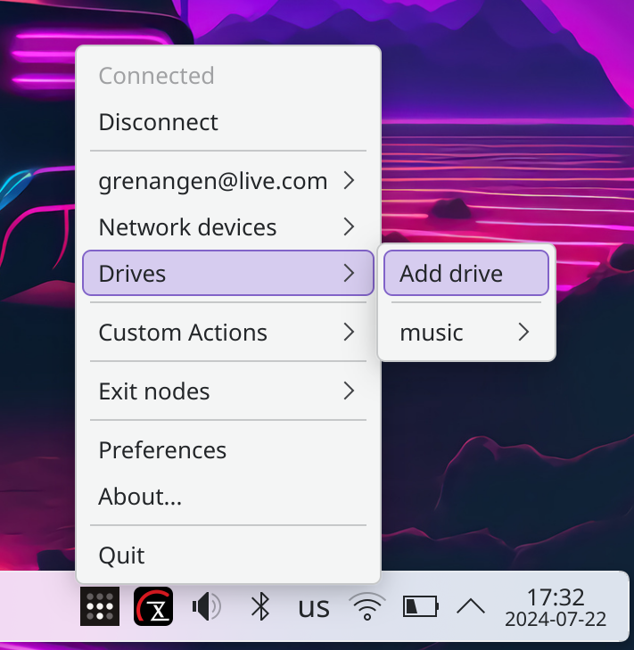
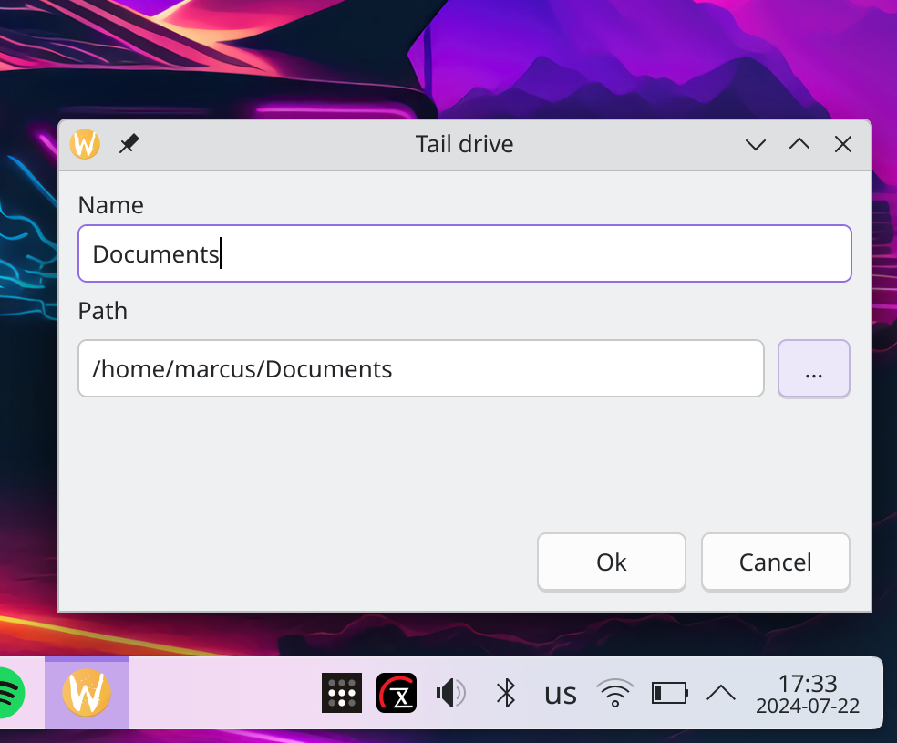
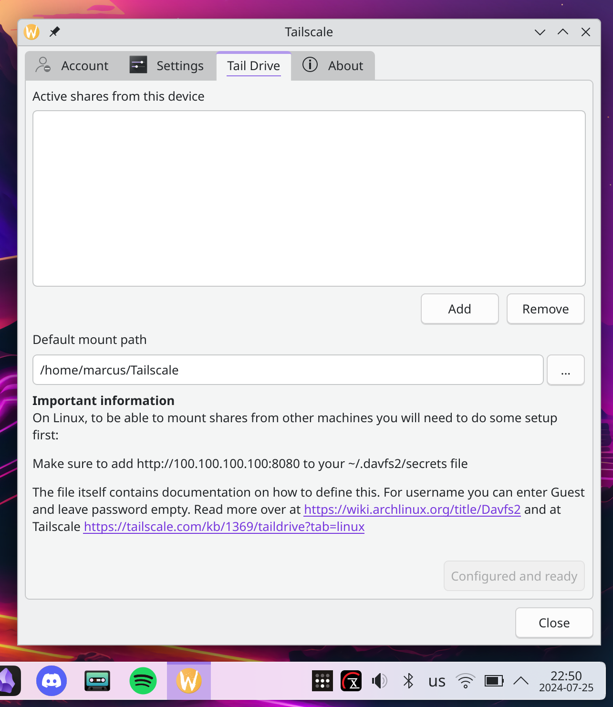

# tail-tray
Tailscale tray menu and UI for Plasma Desktop

**Disclaimer** Please note that I have _no_ association whatsoever with Tailscale Inc. 

This is a personal project and is not endorsed by Tailscale Inc. in any shape or form.

### Features
- [X] Control your Tailscale connection from the tray
- [X] Show IPs
- [X] Show current connection status of your devices
- [X] Set and change your Tailscale exit node
- [X] Proper multi account handling 
- [X] Tail drive support - Working with davfs2 support + additional help setting up davfs2 and mounting etc

### License
GNU General Public License v3.0 - see [LICENSE](LICENSE) for more details

### Installation
For now the easiest and most reliable way to install this is to build it from source.
To do that, please see the Getting started section below.

If you're feeling adventurous, you can download the latest deb release and give that a try, but there are known issues with it.
**_NOTE:_** The deb package that is made as part of the release is not yet working as intended. 
I'm working on fixing this. And if you know how to package for Debian and Ubuntu, feel free to help out. See https://github.com/SneWs/tail-tray/issues/12 for details

### Getting started
1. Install the following dependencies
   * Git, QT 6, cmake and a c++ compiler, for example:
      * On Ubuntu and Ubuntu based distros
         ```bash
         sudo apt install git qt6-tools-dev qt6-tools-dev-tools g++ clang cmake davfs2
         ```
     * On Fedora
        ```bash
        sudo dnf -y git g++ clang cmake install qt6-qtbase-devel qt6-qttools-devel qt6-qtbase-private-devel davfs2
        ```
      * On Arch Linux
         ```bash
         sudo pacman -S git clang cmake qt6-base qt6-tools
         ```
        ```bash 
        # For davfs2 we need to use the AUR
        yay -S davfs2
        ```
2. Clone the repo
3. cd into the repo `cd tail-tray`
4. Make a build directory `mkdir build`
5. cd into the build directory `cd build`
6. Run `cmake ../`
7. Run `make`
8. Run `sudo make install`
9. It will now be installed to `/usr/local/bin/tail-tray` and can be started by running `tail-tray` in a terminal or by clicking the Tail Tray icon in the launcher.

### Participating & Filing bugs
* If you would like to participate in the development of this project, feel free to fork the repo and submit a pull request.
* Bugs, we all get them... Please file an issue in the issues tab and we'll sort it out together.

### Screenshots













