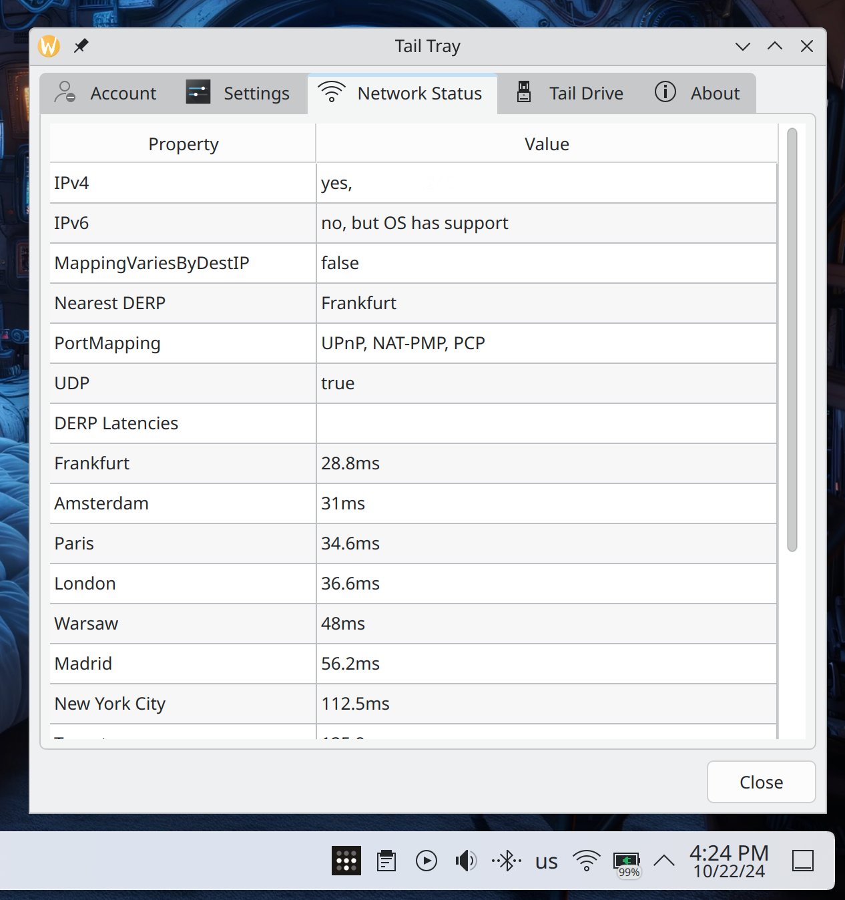
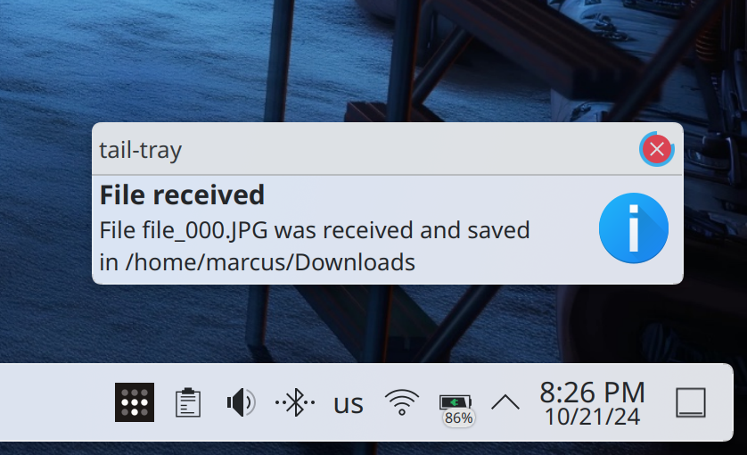

# Tail Tray
Tailscale tray menu and UI for Plasma Desktop

**Disclaimer** Please note that I have _no_ association whatsoever with Tailscale Inc. 

This is a personal project and is not endorsed by Tailscale Inc. in any shape or form.

### Features
- [X] Control your Tailscale connection from the tray
- [X] Show IPs
- [X] Show current connection status of your devices
- [X] Overview of your network and network status
- [X] Set and change your Tailscale exit node
- [X] Proper multi account handling 
- [X] Tail drive support - Working with davfs2 support + additional help setting up davfs2 and mounting etc
- [X] Send files to any device on your Tailnet directly from the tray menu
- [X] Get notified and receive files from any device on your Tailnet to a pre-defined location on disk
- [X] Nix Derivation 

### License
GNU General Public License v3.0 - see [LICENSE](LICENSE) for more details

### Installation
For now the easiest and most reliable way to install this is to build it from source.
To do that, please see the Getting started section below.

### Prerequisites
* Tailscale installed and running - https://tailscale.com 
* davfs2 installed and configured (If you plan on using Tail drives or accessing Tail drives. Tail Tray also helps you to automatically configure this) - https://wiki.archlinux.org/title/Davfs2


### Supported architectures
* x86_64
* ARM64
* Any other architecture that QT 6 supports and where you can compile this project and where Tailscale runs

### Getting started
#### Install with nix
You can install tail-tray with the Nix-Package Manager or on NixOS via the configuration.nix.

> **IMPORTANT:** tail-tray is currently only available on the nix **unstable** channel! The Pull Request for the stable channel is already open: [NixOS/nixpkgs#383072](https://github.com/NixOS/nixpkgs/pull/383072)
##### Nix-Package Manager
```bash
# persistant on NixOS
nix-env -iA nixos.tail-tray nixos.tailscale

# persistant on non NixOS
nix-env -iA nixpkgs.tail-tray nixpkgs.tailscale

# non persistant
nix-shell -p tail-tray tailscale
```

##### NixOS
configuration.nix:
```nix
{pkgs, ...}:

{
...
    environment.systemPackages = with pkgs; [
        tailscale
        tail-tray
    ];
...
}
```
#### Install from source
1. Install the following dependencies
   * Git, QT 6, cmake and a c++ compiler, for example:
      * On Ubuntu and Ubuntu based distros
         ```bash
         sudo apt install git qt6-tools-dev qt6-tools-dev-tools g++ clang cmake davfs2
         ```
     * On Fedora
        ```bash
        sudo dnf install -y git g++ clang cmake qt6-qtbase-devel qt6-qttools-devel qt6-qtbase-private-devel davfs2
        ```
      * On Arch Linux
        * You can use the AUR package from here https://aur.archlinux.org/packages/tail-tray-git provided by @HeavenVolkoff
        * or, build it from source yourself:
         ```bash
         sudo pacman -S git clang cmake qt6-base qt6-tools
         ```
        ```bash 
        # For davfs2 we need to use the AUR
        yay -S davfs2
        ```
      * On openSUSE Tumbleweed and Leap there is a RPM in the repos already. See https://software.opensuse.org/download/package?package=tail-tray&project=openSUSE%3AFactory and https://build.opensuse.org/package/show/network:vpn/tail-tray for details and updates in Factory. A big thank you to Johannes Kastl for setting up the RPM builds!
      * On Windows (Unsupported but currently working)
        Make sure to download and install QT binaries
      * If you are running Gnome and not using Ubuntu, make sure to install AppIndicator so you can see your tray icons. See https://extensions.gnome.org/extension/615/appindicator-support/
2. Clone the repo
3. cd into the repo `cd tail-tray`
4. Run `cmake -B "./build" -DCMAKE_BUILD_TYPE="Release"`
   * If you want to disable DAVFS: `cmake -B "./build" -DDAVFS_ENABLED=OFF -DCMAKE_BUILD_TYPE="Release"`
5. Run `cmake --build "./build" --config Release`
6. Run `cd build`
7. Run `sudo make install`
8. It will now be installed to `/usr/local/bin/tail-tray` and can be started by running `tail-tray` in a terminal or by clicking the Tail Tray icon in the launcher.

### Building on Windows
0. Install QT 6
1. Clone the repo
2. cd  into the repo `cd tail-tray`
3. Make a build directory `mkdir build`
4. Run `cmake -B "./build" -DCMAKE_BUILD_TYPE="Release" -DCMAKE_PREFIX_PATH:PATH=C:/Qt/6.8.2/msvc2022_64 -G "Visual Studio 17 2022"`
   1. NOTE: Make sure to replace the DCMAKE_PREFIX_PATH with the path to your QT install dir
5. Run `cmake --build "./build" --config Release`
6. You should be able to start it by typing `.\build\Release\tail-tray.exe` 

### Windows Binaries
There are Windows binaries (Experimental) available to download from https://github.com/SneWs/tail-tray/releases/tag/latest 
The Tail-Tray-Windows.zip should just be to extract and run tail-tray.exe

__NOTE:__ This is still _experimental_ and Windows builds aren't tested as frequent as the Linux builds. And the binaries here are built on each push to master. This means, no stability guarantees. But at least you don't have to build it yourself to give it a spin!

### Participating & Filing bugs
* If you would like to participate in the development of this project, feel free to fork the repo and submit a pull request.
* Bugs, we all get them... Please file an issue in the issues tab and we'll sort it out together.

### Screenshots







