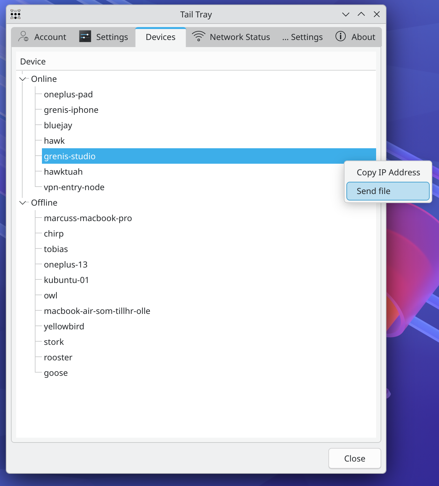
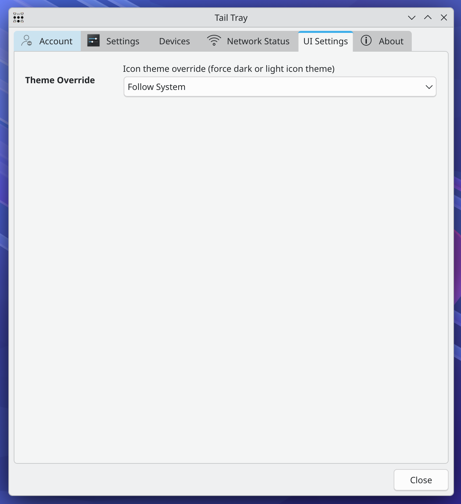

# Tail Tray
Tailscale tray menu and UI for Plasma Desktop

**Disclaimer** Please note that I have _no_ association whatsoever with Tailscale Inc. 

This is a personal project and is not endorsed by Tailscale Inc. in any shape or form.

### Features
- [X] Control your Tailscale connection from the tray
- [X] Show IPs
- [X] Show current connection status of your devices
- [X] Overview of your network and network status
- [X] Set and change your Tailscale exit node
- [X] Proper multi account handling 
- [X] Mullvad Exit nodes
- [X] Tail drive support - Working with davfs2 support + additional help setting up davfs2 and mounting etc
- [X] Send files to any device on your Tailnet directly from the tray menu
- [X] Get notified and receive files from any device on your Tailnet to a pre-defined location on disk
- [X] Pre-built binaries for major distros and experimental Windows support

### License
GNU General Public License v3.0 - see [LICENSE](LICENSE) for more details

### Installation
For now the easiest and most reliable way to install this is to build it from source.
To do that, please see the Getting started section below.

### Prerequisites
* Tailscale installed and running - https://tailscale.com 
* davfs2 installed and configured (If you plan on using Tail drives or accessing Tail drives. Tail Tray also helps you to automatically configure this) - https://wiki.archlinux.org/title/Davfs2

### Supported architectures
* x86_64
* ARM64
* Any other architecture that QT 6 supports and where you can compile this project and where Tailscale runs

### Getting started

### Pre-built packages
 * [Debian / Ubuntu / Mint based distros](https://github.com/SneWs/tail-tray/releases)
 * [OpenSUSE & Fedora RPMs](https://software.opensuse.org/download.html?project=home%3Aayankov&package=tail-tray)
 * [NixOS](/docs/nix-os.md)
 * [Windows (EXPERIMENTAL! latest unstable only, and not signed)](https://github.com/SneWs/tail-tray/releases/download/latest/Tail-Tray-Windows.zip)

### Build and install from Source
 * [On Linux](/docs/build-from-src.md)
 * [On Windows](/docs/build-from-src-windows.md)

### Scriptable actions
To learn more about how to write and use scriptable actions, please read the [Scriptable actions Guid](docs/scriptable-actions.md)

### Participating & Filing bugs
* If you would like to participate in the development of this project, feel free to fork the repo and submit a pull request.
* Bugs, we all get them... Please file an issue in the issues tab and we'll sort it out together.

### Screenshots

